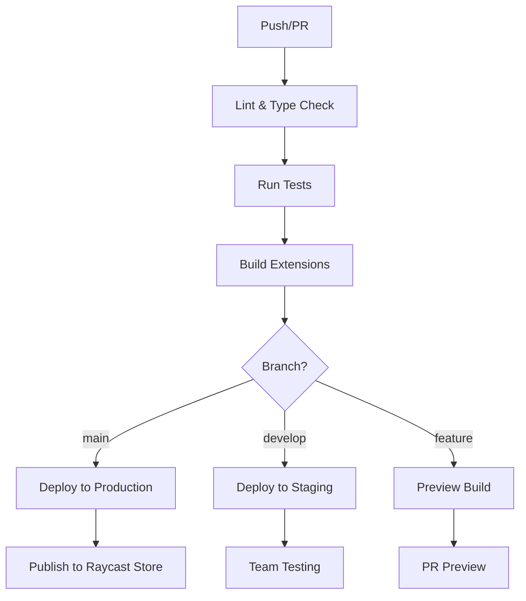

# CI/CD Pipeline & Deployment Documentation

## 🚀 Overview

This guide covers the complete CI/CD pipeline for WeMake AI Raycast extensions, including automated testing, building,
publishing to the Raycast Store, and deployment strategies for both public and team extensions using GitHub Actions and
Nx.

## 🏗️ CI/CD Architecture

### Pipeline Overview



### Workflow Triggers

- **Push to main**: Full pipeline with production deployment
- **Push to develop**: Staging deployment and team testing
- **Pull Requests**: Validation pipeline with preview builds
- **Manual Dispatch**: On-demand deployments
- **Scheduled**: Nightly builds and dependency updates

## 📋 GitHub Actions Workflows

### Main CI/CD Workflow

```yaml
# .github/workflows/ci-cd.yml
name: CI/CD Pipeline

on:
  push:
    branches: [main, develop]
  pull_request:
    branches: [main, develop]
  workflow_dispatch:
    inputs:
      environment:
        description: "Deployment environment"
        required: true
        default: "staging"
        type: choice
        options:
          - staging
          - production
      extensions:
        description: 'Extensions to deploy (comma-separated, or "all")'
        required: false
        default: "all"

env:
  NODE_VERSION: "20"
  BUN_VERSION: "latest"
  NX_CLOUD_ACCESS_TOKEN: ${{ secrets.NX_CLOUD_ACCESS_TOKEN }}

jobs:
  setup:
    runs-on: ubuntu-latest
    outputs:
      affected-extensions: ${{ steps.affected.outputs.extensions }}
      has-changes: ${{ steps.affected.outputs.has-changes }}
    steps:
      - name: Checkout
        uses: actions/checkout@v4
        with:
          fetch-depth: 0

      - name: Setup Bun
        uses: oven-sh/setup-bun@v1
        with:
          bun-version: ${{ env.BUN_VERSION }}

      - name: Install dependencies
        run: bun install --frozen-lockfile

      - name: Get affected extensions
        id: affected
        run: |
          if [ "${{ github.event_name }}" = "workflow_dispatch" ]; then
            if [ "${{ github.event.inputs.extensions }}" = "all" ]; then
              EXTENSIONS=$(bun nx show projects --type=app --json | jq -r '.[]' | tr '\n' ',' | sed 's/,$//')
            else
              EXTENSIONS="${{ github.event.inputs.extensions }}"
            fi
          else
            EXTENSIONS=$(bun nx show projects --affected --type=app --json | jq -r '.[]' | tr '\n' ',' | sed 's/,$//')
          fi

          echo "extensions=$EXTENSIONS" >> $GITHUB_OUTPUT

          if [ -n "$EXTENSIONS" ]; then
            echo "has-changes=true" >> $GITHUB_OUTPUT
          else
            echo "has-changes=false" >> $GITHUB_OUTPUT
          fi

          echo "Affected extensions: $EXTENSIONS"

  lint-and-typecheck:
    runs-on: ubuntu-latest
    needs: setup
    if: needs.setup.outputs.has-changes == 'true'
    steps:
      - name: Checkout
        uses: actions/checkout@v4

      - name: Setup Bun
        uses: oven-sh/setup-bun@v1
        with:
          bun-version: ${{ env.BUN_VERSION }}

      - name: Install dependencies
        run: bun install --frozen-lockfile

      - name: Lint affected projects
        run: bun nx affected --target=lint --parallel=3

      - name: Type check affected projects
        run: bun nx affected --target=type-check --parallel=3

  test:
    runs-on: ubuntu-latest
    needs: setup
    if: needs.setup.outputs.has-changes == 'true'
    steps:
      - name: Checkout
        uses: actions/checkout@v4

      - name: Setup Bun
        uses: oven-sh/setup-bun@v1
        with:
          bun-version: ${{ env.BUN_VERSION }}

      - name: Install dependencies
        run: bun install --frozen-lockfile

      - name: Run tests
        run: bun nx affected --target=test --parallel=3 --coverage

      - name: Upload coverage reports
        uses: codecov/codecov-action@v3
        with:
          directory: ./coverage
          flags: unittests
          name: codecov-umbrella
          fail_ci_if_error: true

  build:
    runs-on: ubuntu-latest
    needs: [setup, lint-and-typecheck, test]
    if: needs.setup.outputs.has-changes == 'true'
    strategy:
      matrix:
        extension: ${{ fromJson(format('[{0}]', needs.setup.outputs.affected-extensions)) }}
    steps:
      - name: Checkout
        uses: actions/checkout@v4

      - name: Setup Bun
        uses: oven-sh/setup-bun@v1
        with:
          bun-version: ${{ env.BUN_VERSION }}

      - name: Install dependencies
        run: bun install --frozen-lockfile

      - name: Build extension
        run: bun nx build ${{ matrix.extension }}

      - name: Upload build artifacts
        uses: actions/upload-artifact@v3
        with:
          name: ${{ matrix.extension }}-build
          path: dist/src/${{ matrix.extension }}
          retention-days: 30

  security-scan:
    runs-on: ubuntu-latest
    needs: setup
    if: needs.setup.outputs.has-changes == 'true'
    steps:
      - name: Checkout
        uses: actions/checkout@v4

      - name: Run Trivy vulnerability scanner
        uses: aquasecurity/trivy-action@master
        with:
          scan-type: "fs"
          scan-ref: "."
          format: "sarif"
          output: "trivy-results.sarif"

      - name: Upload Trivy scan results
        uses: github/codeql-action/upload-sarif@v2
        with:
          sarif_file: "trivy-results.sarif"

      - name: Audit dependencies
        run: bun audit

  deploy-staging:
    runs-on: ubuntu-latest
    needs: [setup, build]
    if: |
      needs.setup.outputs.has-changes == 'true' && 
      (github.ref == 'refs/heads/develop' || 
       (github.event_name == 'workflow_dispatch' && github.event.inputs.environment == 'staging'))
    environment: staging
    strategy:
      matrix:
        extension: ${{ fromJson(format('[{0}]', needs.setup.outputs.affected-extensions)) }}
    steps:
      - name: Checkout
        uses: actions/checkout@v4

      - name: Download build artifacts
        uses: actions/download-artifact@v3
        with:
          name: ${{ matrix.extension }}-build
          path: dist/src/${{ matrix.extension }}

      - name: Deploy to staging
        run: |
          echo "Deploying ${{ matrix.extension }} to staging environment"
          # Add staging deployment logic here

  deploy-production:
    runs-on: ubuntu-latest
    needs: [setup, build, security-scan]
    if: |
      needs.setup.outputs.has-changes == 'true' && 
      (github.ref == 'refs/heads/main' || 
       (github.event_name == 'workflow_dispatch' && github.event.inputs.environment == 'production'))
    environment: production
    strategy:
      matrix:
        extension: ${{ fromJson(format('[{0}]', needs.setup.outputs.affected-extensions)) }}
    steps:
      - name: Checkout
        uses: actions/checkout@v4

      - name: Download build artifacts
        uses: actions/download-artifact@v3
        with:
          name: ${{ matrix.extension }}-build
          path: dist/src/${{ matrix.extension }}

      - name: Publish to Raycast Store
        env:
          RAYCAST_TOKEN: ${{ secrets.RAYCAST_TOKEN }}
        run: |
          echo "Publishing ${{ matrix.extension }} to Raycast Store"
          npx @raycast/api@latest publish ${{ matrix.extension }}

  notify:
    runs-on: ubuntu-latest
    needs: [deploy-staging, deploy-production]
    if: always()
    steps:
      - name: Notify deployment status
        uses: 8398a7/action-slack@v3
        with:
          status: ${{ job.status }}
          channel: "#deployments"
          webhook_url: ${{ secrets.SLACK_WEBHOOK }}
```

### Pull Request Validation

```yaml
# .github/workflows/pr-validation.yml
name: PR Validation

on:
  pull_request:
    types: [opened, synchronize, reopened]

env:
  NODE_VERSION: "20"
  BUN_VERSION: "latest"

jobs:
  validate:
    runs-on: ubuntu-latest
    steps:
      - name: Checkout
        uses: actions/checkout@v4
        with:
          fetch-depth: 0

      - name: Setup Bun
        uses: oven-sh/setup-bun@v1
        with:
          bun-version: ${{ env.BUN_VERSION }}

      - name: Install dependencies
        run: bun install --frozen-lockfile

      - name: Validate PR title
        uses: amannn/action-semantic-pull-request@v5
        env:
          GITHUB_TOKEN: ${{ secrets.GITHUB_TOKEN }}

      - name: Check affected extensions
        id: affected
        run: |
          AFFECTED=$(bun nx show projects --affected --type=app --json | jq -r '.[]' | tr '\n' ',' | sed 's/,$//')
          echo "extensions=$AFFECTED" >> $GITHUB_OUTPUT
          echo "Affected extensions: $AFFECTED"

      - name: Run quality checks
        if: steps.affected.outputs.extensions != ''
        run: |
          bun nx affected --target=lint --parallel=3
          bun nx affected --target=type-check --parallel=3
          bun nx affected --target=test --parallel=3 --coverage
          bun nx affected --target=build --parallel=3

      - name: Comment PR with results
        uses: actions/github-script@v6
        if: steps.affected.outputs.extensions != ''
        with:
          script: |
            const extensions = '${{ steps.affected.outputs.extensions }}'.split(',').filter(Boolean);

            const comment = `## 🔍 PR Validation Results

            **Affected Extensions:** ${extensions.join(', ')}

            ✅ All quality checks passed!

            ### What was tested:
            - Linting and code style
            - TypeScript type checking
            - Unit and integration tests
            - Build compilation

            The extensions are ready for review! 🚀`;

            github.rest.issues.createComment({
              issue_number: context.issue.number,
              owner: context.repo.owner,
              repo: context.repo.repo,
              body: comment
            });
```

### Dependency Updates

```yaml
# .github/workflows/dependency-updates.yml
name: Dependency Updates

on:
  schedule:
    - cron: "0 2 * * 1" # Weekly on Monday at 2 AM
  workflow_dispatch:

jobs:
  update-dependencies:
    runs-on: ubuntu-latest
    steps:
      - name: Checkout
        uses: actions/checkout@v4
        with:
          token: ${{ secrets.GITHUB_TOKEN }}

      - name: Setup Bun
        uses: oven-sh/setup-bun@v1
        with:
          bun-version: latest

      - name: Update dependencies
        run: |
          bun update
          bun nx migrate latest
          bun install

      - name: Run tests
        run: bun nx run-many --target=test --all

      - name: Create Pull Request
        uses: peter-evans/create-pull-request@v5
        with:
          token: ${{ secrets.GITHUB_TOKEN }}
          commit-message: "chore: update dependencies"
          title: "chore: weekly dependency updates"
          body: |
            ## 📦 Weekly Dependency Updates

            This PR contains automated dependency updates.

            ### Changes:
            - Updated all dependencies to latest versions
            - Applied Nx migrations if available
            - Verified all tests pass

            Please review the changes and merge if everything looks good.
          branch: chore/dependency-updates
          delete-branch: true
```

## 🏪 Raycast Store Publishing

### Publishing Configuration

```typescript
// scripts/publish.ts
import { spawnSync } from "child_process";
import { readFileSync, existsSync } from "fs";
import { spawnSync, execSync } from "child_process";
import path from "path";

interface PublishConfig {
  extension: string;
  environment: "staging" | "production";
  dryRun?: boolean;
}

class RaycastPublisher {
  private config: PublishConfig;

  constructor(config: PublishConfig) {
    this.config = config;
  }

  async publish(): Promise<void> {
    console.log(`📦 Publishing ${this.config.extension} to ${this.config.environment}`);

    // Validate extension
    await this.validateExtension();

    // Build extension
    await this.buildExtension();

    // Publish to Raycast
    await this.publishToRaycast();

    console.log(`✅ Successfully published ${this.config.extension}`);
  }

  private async validateExtension(): Promise<void> {
    const extensionPath = path.join("src", this.config.extension);

    if (!existsSync(extensionPath)) {
      throw new Error(`Extension ${this.config.extension} not found`);
    }

    const packageJsonPath = path.join(extensionPath, "package.json");
    if (!existsSync(packageJsonPath)) {
      throw new Error(`package.json not found for ${this.config.extension}`);
    }

    const packageJson = JSON.parse(readFileSync(packageJsonPath, "utf-8"));

    // Validate required fields
    const requiredFields = ["name", "title", "description", "author", "license"];
    for (const field of requiredFields) {
      if (!packageJson[field]) {
        throw new Error(`Missing required field: ${field}`);
      }
    }

    console.log(`✅ Extension ${this.config.extension} validation passed`);
  }

  private async buildExtension(): Promise<void> {
    console.log(`🔨 Building ${this.config.extension}...`);

    try {
      spawnSync("bun", ["nx", "build", this.config.extension], { stdio: "inherit", cwd: process.cwd() });
      console.log(`✅ Build completed for ${this.config.extension}`);
    } catch (error) {
      throw new Error(`Build failed for ${this.config.extension}: ${error}`);
    }
  }

  private async publishToRaycast(): Promise<void> {
    const command = this.config.dryRun
      ? `npx @raycast/api@latest publish ${this.config.extension} --dry-run`
      : `npx @raycast/api@latest publish ${this.config.extension}`;

    console.log(`🚀 Publishing to Raycast Store...`);

    try {
      execSync(command, {
        stdio: "inherit",
        cwd: process.cwd(),
        env: {
          ...process.env,
          RAYCAST_TOKEN: process.env.RAYCAST_TOKEN
        }
      });
    } catch (error) {
      throw new Error(`Raycast publishing failed: ${error}`);
    }
  }
}

// CLI interface
if (require.main === module) {
  const args = process.argv.slice(2);
  const extension = args[0];
  const environment = (args[1] as "staging" | "production") || "staging";
  const dryRun = args.includes("--dry-run");

  if (!extension) {
    console.error("Usage: bun run scripts/publish.ts <extension> [environment] [--dry-run]");
    process.exit(1);
  }

  const publisher = new RaycastPublisher({ extension, environment, dryRun });

  publisher.publish().catch((error) => {
    console.error("❌ Publishing failed:", error.message);
    process.exit(1);
  });
}

export { RaycastPublisher };
```

### Publishing Scripts

```json
// package.json scripts
{
  "scripts": {
    "publish:extension": "bun run scripts/publish.ts",
    "publish:all": "bun nx run-many --target=publish --all",
    "publish:affected": "bun nx affected --target=publish",
    "publish:dry-run": "bun run scripts/publish.ts --dry-run"
  }
}
```

## 🔧 Nx Build Configuration

### Project Configuration

```json
// src/my-extension/project.json
{
  "name": "my-extension",
  "$schema": "../../node_modules/nx/schemas/project-schema.json",
  "projectType": "application",
  "sourceRoot": "src/my-extension/src",
  "targets": {
    "build": {
      "executor": "@nx/webpack:webpack",
      "outputs": ["{options.outputPath}"],
      "options": {
        "outputPath": "dist/src/my-extension",
        "main": "src/my-extension/src/index.tsx",
        "tsConfig": "src/my-extension/tsconfig.json",
        "webpackConfig": "webpack.config.js"
      },
      "configurations": {
        "production": {
          "optimization": true,
          "extractLicenses": false,
          "sourceMap": false
        }
      }
    },
    "lint": {
      "executor": "@nx/eslint:lint",
      "outputs": ["{options.outputFile}"],
      "options": {
        "lintFilePatterns": ["src/my-extension/**/*.{ts,tsx,js,jsx}"]
      }
    },
    "test": {
      "executor": "@nx/vite:test",
      "outputs": ["{workspaceRoot}/coverage/src/my-extension"],
      "options": {
        "passWithNoTests": true,
        "reportsDirectory": "../../coverage/src/my-extension"
      }
    },
    "type-check": {
      "executor": "nx:run-commands",
      "options": {
        "command": "tsc --noEmit",
        "cwd": "src/my-extension"
      }
    },
    "publish": {
      "executor": "nx:run-commands",
      "dependsOn": ["build"],
      "options": {
        "command": "bun run scripts/publish.ts my-extension production"
      }
    }
  },
  "tags": ["type:app", "scope:extensions"]
}
```

### Webpack Configuration

```javascript
// webpack.config.js
const path = require("path");
const { composePlugins, withNx } = require("@nx/webpack");

module.exports = composePlugins(withNx(), (config, { options, context }) => {
  // Raycast-specific configuration
  config.target = "node";
  config.externals = {
    "@raycast/api": "commonjs @raycast/api"
  };

  // Optimize for production
  if (options.optimization) {
    config.optimization = {
      ...config.optimization,
      minimize: true,
      sideEffects: false
    };
  }

  // Handle TypeScript and React
  config.module.rules.push({
    test: /\.(ts|tsx)$/,
    use: [
      {
        loader: "ts-loader",
        options: {
          transpileOnly: true,
          configFile: path.join(context.root, "tsconfig.json")
        }
      }
    ],
    exclude: /node_modules/
  });

  return config;
});
```

## 🌍 Environment Management

### Environment Configuration

```typescript
// scripts/env-config.ts
interface EnvironmentConfig {
  name: string;
  raycastToken: string;
  analyticsKey?: string;
  apiEndpoint?: string;
  features: string[];
}

const environments: Record<string, EnvironmentConfig> = {
  development: {
    name: "development",
    raycastToken: process.env.RAYCAST_DEV_TOKEN || "",
    analyticsKey: process.env.POSTHOG_DEV_KEY,
    apiEndpoint: "https://api-dev.wemake.ai",
    features: ["debug", "analytics"]
  },
  staging: {
    name: "staging",
    raycastToken: process.env.RAYCAST_STAGING_TOKEN || "",
    analyticsKey: process.env.POSTHOG_STAGING_KEY,
    apiEndpoint: "https://api-staging.wemake.ai",
    features: ["analytics"]
  },
  production: {
    name: "production",
    raycastToken: process.env.RAYCAST_TOKEN || "",
    analyticsKey: process.env.POSTHOG_KEY,
    apiEndpoint: "https://api.wemake.ai",
    features: ["analytics", "error-reporting"]
  }
};

export function getEnvironmentConfig(env: string): EnvironmentConfig {
  const config = environments[env];
  if (!config) {
    throw new Error(`Unknown environment: ${env}`);
  }
  return config;
}

export function validateEnvironment(env: string): void {
  const config = getEnvironmentConfig(env);

  if (!config.raycastToken) {
    throw new Error(`Missing Raycast token for environment: ${env}`);
  }

  console.log(`✅ Environment ${env} configuration is valid`);
}
```

### GitHub Environments

```yaml
# .github/environments/staging.yml
name: staging
protection_rules:
  - type: required_reviewers
    required_reviewers:
      - wemake-ai/developers
secrets:
  RAYCAST_STAGING_TOKEN: ${{ secrets.RAYCAST_STAGING_TOKEN }}
  POSTHOG_STAGING_KEY: ${{ secrets.POSTHOG_STAGING_KEY }}
variables:
  ENVIRONMENT: staging
  API_ENDPOINT: https://api-staging.wemake.ai
```

```yaml
# .github/environments/production.yml
name: production
protection_rules:
  - type: required_reviewers
    required_reviewers:
      - wemake-ai/maintainers
  - type: wait_timer
    wait_timer: 5
secrets:
  RAYCAST_TOKEN: ${{ secrets.RAYCAST_TOKEN }}
  POSTHOG_KEY: ${{ secrets.POSTHOG_KEY }}
variables:
  ENVIRONMENT: production
  API_ENDPOINT: https://api.wemake.ai
```

## 📊 Deployment Strategies

### Blue-Green Deployment

```typescript
// scripts/blue-green-deploy.ts
import { RaycastPublisher } from "./publish";

class BlueGreenDeployment {
  private currentVersion: string;
  private newVersion: string;
  private extensions: string[];

  constructor(extensions: string[], currentVersion: string, newVersion: string) {
    this.extensions = extensions;
    this.currentVersion = currentVersion;
    this.newVersion = newVersion;
  }

  async deploy(): Promise<void> {
    console.log("🔄 Starting blue-green deployment...");

    try {
      // Deploy to green environment (staging)
      await this.deployToGreen();

      // Run health checks
      await this.runHealthChecks();

      // Switch traffic to green
      await this.switchToGreen();

      // Cleanup blue environment
      await this.cleanupBlue();

      console.log("✅ Blue-green deployment completed successfully");
    } catch (error) {
      console.error("❌ Deployment failed, rolling back...");
      await this.rollback();
      throw error;
    }
  }

  private async deployToGreen(): Promise<void> {
    console.log("🟢 Deploying to green environment...");

    for (const extension of this.extensions) {
      const publisher = new RaycastPublisher({
        extension,
        environment: "staging"
      });
      await publisher.publish();
    }
  }

  private async runHealthChecks(): Promise<void> {
    console.log("🏥 Running health checks...");

    // Add health check logic here
    // - Verify extensions load correctly
    // - Check API connectivity
    // - Validate core functionality

    await new Promise((resolve) => setTimeout(resolve, 5000)); // Simulate checks
    console.log("✅ Health checks passed");
  }

  private async switchToGreen(): Promise<void> {
    console.log("🔄 Switching traffic to green environment...");

    for (const extension of this.extensions) {
      const publisher = new RaycastPublisher({
        extension,
        environment: "production"
      });
      await publisher.publish();
    }
  }

  private async cleanupBlue(): Promise<void> {
    console.log("🧹 Cleaning up blue environment...");
    // Cleanup logic here
  }

  private async rollback(): Promise<void> {
    console.log("⏪ Rolling back to previous version...");
    // Rollback logic here
  }
}
```

### Canary Deployment

```typescript
// scripts/canary-deploy.ts
class CanaryDeployment {
  private extensions: string[];
  private canaryPercentage: number;

  constructor(extensions: string[], canaryPercentage = 10) {
    this.extensions = extensions;
    this.canaryPercentage = canaryPercentage;
  }

  async deploy(): Promise<void> {
    console.log(`🐤 Starting canary deployment (${this.canaryPercentage}%)...`);

    // Deploy canary version
    await this.deployCanary();

    // Monitor metrics
    await this.monitorCanary();

    // Gradually increase traffic
    await this.graduateCanary();

    console.log("✅ Canary deployment completed");
  }

  private async deployCanary(): Promise<void> {
    // Deploy to subset of users
    console.log("🚀 Deploying canary version...");
  }

  private async monitorCanary(): Promise<void> {
    // Monitor error rates, performance metrics
    console.log("📊 Monitoring canary metrics...");
  }

  private async graduateCanary(): Promise<void> {
    // Gradually increase traffic to 100%
    console.log("📈 Graduating canary to full deployment...");
  }
}
```

## 🔍 Monitoring & Alerting

### Deployment Monitoring

```typescript
// scripts/deployment-monitor.ts
import { PostHog } from "posthog-node";

class DeploymentMonitor {
  private posthog: PostHog;
  private slackWebhook: string;

  constructor() {
    this.posthog = new PostHog(process.env.POSTHOG_KEY || "");
    this.slackWebhook = process.env.SLACK_WEBHOOK || "";
  }

  async trackDeployment(extension: string, version: string, environment: string): Promise<void> {
    // Track deployment event
    this.posthog.capture({
      distinctId: "deployment-system",
      event: "extension_deployed",
      properties: {
        extension,
        version,
        environment,
        timestamp: new Date().toISOString()
      }
    });

    // Send Slack notification
    await this.sendSlackNotification({
      extension,
      version,
      environment,
      status: "success"
    });
  }

  async trackDeploymentFailure(extension: string, error: string): Promise<void> {
    // Track failure event
    this.posthog.capture({
      distinctId: "deployment-system",
      event: "extension_deployment_failed",
      properties: {
        extension,
        error,
        timestamp: new Date().toISOString()
      }
    });

    // Send alert
    await this.sendSlackNotification({
      extension,
      error,
      status: "failed"
    });
  }

  private async sendSlackNotification(data: any): Promise<void> {
    if (!this.slackWebhook) return;

    const message =
      data.status === "success"
        ? `✅ Successfully deployed ${data.extension} v${data.version} to ${data.environment}`
        : `❌ Failed to deploy ${data.extension}: ${data.error}`;

    await fetch(this.slackWebhook, {
      method: "POST",
      headers: { "Content-Type": "application/json" },
      body: JSON.stringify({ text: message })
    });
  }
}
```

## 🚨 Rollback Procedures

### Automated Rollback

```sh
#!/bin/bash
# scripts/rollback.sh

set -e

EXTENSION=$1
TARGET_VERSION=$2
ENVIRONMENT=${3:-production}

if [ -z "$EXTENSION" ] || [ -z "$TARGET_VERSION" ]; then
  echo "Usage: ./rollback.sh <extension> <target-version> [environment]"
  exit 1
fi

echo "🔄 Rolling back $EXTENSION to version $TARGET_VERSION in $ENVIRONMENT"

# Checkout target version
git fetch --tags
git checkout "v$TARGET_VERSION"

# Install dependencies
bun install

# Build extension
bun nx build $EXTENSION

# Deploy
bun run scripts/publish.ts $EXTENSION $ENVIRONMENT

echo "✅ Rollback completed successfully"

# Send notification
curl -X POST $SLACK_WEBHOOK \
  -H 'Content-Type: application/json' \
  -d "{
    \"text\": \"⏪ Rolled back $EXTENSION to version $TARGET_VERSION in $ENVIRONMENT\"
  }"
```

### Manual Rollback Workflow

```yaml
# .github/workflows/rollback.yml
name: Manual Rollback

on:
  workflow_dispatch:
    inputs:
      extension:
        description: "Extension to rollback"
        required: true
        type: string
      target_version:
        description: "Target version to rollback to"
        required: true
        type: string
      environment:
        description: "Environment to rollback"
        required: true
        type: choice
        options:
          - staging
          - production

jobs:
  rollback:
    runs-on: ubuntu-latest
    environment: ${{ github.event.inputs.environment }}
    steps:
      - name: Checkout target version
        uses: actions/checkout@v4
        with:
          ref: v${{ github.event.inputs.target_version }}

      - name: Setup Bun
        uses: oven-sh/setup-bun@v1
        with:
          bun-version: latest

      - name: Install dependencies
        run: bun install --frozen-lockfile

      - name: Build extension
        run: bun nx build ${{ github.event.inputs.extension }}

      - name: Deploy rollback
        env:
          RAYCAST_TOKEN: ${{ secrets.RAYCAST_TOKEN }}
        run: |
          bun run scripts/publish.ts ${{ github.event.inputs.extension }} ${{ github.event.inputs.environment }}

      - name: Notify rollback
        uses: 8398a7/action-slack@v3
        with:
          status: custom
          custom_payload: |
            {
              text: `⏪ Rolled back ${{ github.event.inputs.extension }} to version ${{ github.event.inputs.target_version }} in ${{ github.event.inputs.environment }}`,
              attachments: [{
                color: 'warning',
                fields: [{
                  title: 'Extension',
                  value: '${{ github.event.inputs.extension }}',
                  short: true
                }, {
                  title: 'Version',
                  value: '${{ github.event.inputs.target_version }}',
                  short: true
                }, {
                  title: 'Environment',
                  value: '${{ github.event.inputs.environment }}',
                  short: true
                }]
              }]
            }
        env:
          SLACK_WEBHOOK_URL: ${{ secrets.SLACK_WEBHOOK }}
```

## 📋 Best Practices

### 1. Version Management

- **Semantic Versioning**: Use semver for all extensions
- **Git Tags**: Tag releases for easy rollbacks
- **Changelog**: Maintain detailed changelogs
- **Release Notes**: Generate automated release notes

### 2. Security

- **Secret Management**: Use GitHub Secrets for sensitive data
- **Token Rotation**: Regularly rotate API tokens
- **Dependency Scanning**: Automated vulnerability scanning
- **Code Signing**: Sign releases for integrity

### 3. Performance

- **Parallel Builds**: Build extensions in parallel
- **Caching**: Cache dependencies and build artifacts
- **Incremental Builds**: Only build affected extensions
- **Artifact Management**: Efficient artifact storage

### 4. Reliability

- **Health Checks**: Comprehensive deployment validation
- **Rollback Strategy**: Quick rollback procedures
- **Monitoring**: Real-time deployment monitoring
- **Alerting**: Immediate failure notifications

### 5. Team Collaboration

- **Code Reviews**: Required reviews for production
- **Environment Protection**: Protected production deployments
- **Documentation**: Clear deployment procedures
- **Communication**: Automated status updates

## 🚀 Quick Commands

```sh
# Build all extensions
bun nx run-many --target=build --all

# Build affected extensions
bun nx affected --target=build

# Test before deployment
bun nx run-many --target=test --all --coverage

# Deploy specific extension
bun run scripts/publish.ts my-extension production

# Deploy all affected extensions
bun nx affected --target=publish

# Rollback extension
./scripts/rollback.sh my-extension 1.2.0 production

# Check deployment status
bun run scripts/deployment-status.ts
```

---

**Previous**: [Testing Strategy & Implementation](./04-testing-strategy.md) | **Next**:
[Monitoring & Analytics Integration](./06-monitoring-analytics.md)
