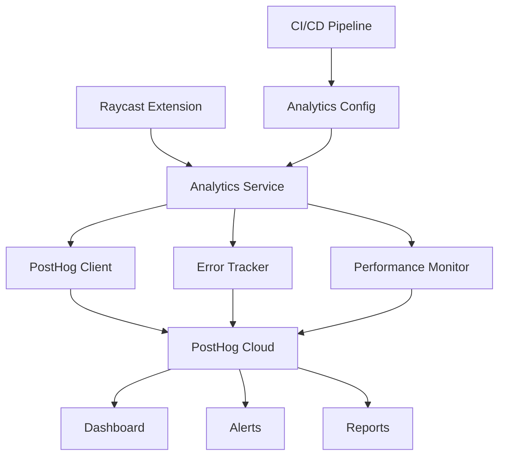

# Monitoring & Analytics Integration Guide

## 📊 Overview

This guide covers the integration of PostHog analytics and monitoring systems for WeMake AI Raycast extensions,
including user behavior tracking, error monitoring, performance metrics, and data-driven insights for continuous
improvement.

## 🎯 Analytics Strategy

### Key Metrics to Track

```typescript
// types/analytics.ts
export interface ExtensionMetrics {
  // User Engagement
  commandExecutions: number;
  sessionDuration: number;
  dailyActiveUsers: number;
  weeklyActiveUsers: number;
  monthlyActiveUsers: number;

  // Feature Usage
  featureAdoption: Record<string, number>;
  commandPopularity: Record<string, number>;
  searchQueries: number;

  // Performance
  responseTime: number;
  errorRate: number;
  crashRate: number;
  loadTime: number;

  // AI Integration
  aiRequestCount: number;
  aiResponseTime: number;
  aiSuccessRate: number;

  // MCP Integration
  mcpConnectionCount: number;
  mcpRequestLatency: number;
  mcpErrorRate: number;
}

export interface UserBehavior {
  userId: string;
  sessionId: string;
  timestamp: Date;
  action: string;
  context: Record<string, any>;
  metadata?: Record<string, any>;
}

export interface ErrorEvent {
  errorId: string;
  type: "runtime" | "network" | "validation" | "ai" | "mcp";
  message: string;
  stack?: string;
  context: Record<string, any>;
  userId?: string;
  timestamp: Date;
}
```

### Analytics Architecture



## 🔧 PostHog Integration

### Core Analytics Service

```typescript
// lib/analytics/posthog-service.ts
import { PostHog } from "posthog-node";
import { getPreferenceValues } from "@raycast/api";
import { ExtensionMetrics, UserBehavior, ErrorEvent } from "../types/analytics";
import { randomUUID } from "crypto";

interface AnalyticsConfig {
  apiKey: string;
  host?: string;
  debug?: boolean;
  flushAt?: number;
  flushInterval?: number;
  enableErrorTracking?: boolean;
  enablePerformanceTracking?: boolean;
}

class PostHogAnalytics {
  private client: PostHog;
  private config: AnalyticsConfig;
  private userId: string;
  private sessionId: string;
  private isEnabled: boolean;

  constructor(config: AnalyticsConfig) {
    this.config = config;
    this.isEnabled = this.shouldEnableAnalytics();

    if (this.isEnabled) {
      this.client = new PostHog(config.apiKey, {
        host: config.host || "https://app.posthog.com",
        flushAt: config.flushAt || 20,
        flushInterval: config.flushInterval || 10000
      });

      this.userId = this.generateUserId();
      this.sessionId = this.generateSessionId();

      // Initialize session
      this.trackSession();
    }
  }

  /**
   * Check if analytics should be enabled based on user preferences
   */
  private shouldEnableAnalytics(): boolean {
    try {
      const preferences = getPreferenceValues<{ enableAnalytics?: boolean }>();
      return preferences.enableAnalytics === true; // Default to *disabled* until opted-in
    } catch {
      return false; // Default to disabled if preferences unavailable
    }
  }

  /**
   * Generate anonymous user ID
   */
  private generateUserId(): string {
    // Fully anonymous, collision-resistant identifier
    return `raycast_${randomUUID().slice(0, 8)}`;
  }

  /**
   * Generate session ID
   */
  private generateSessionId(): string {
    return `session_${Date.now()}_${Math.random().toString(36).substr(2, 9)}`;
  }

  /**
   * Track session start
   */
  private trackSession(): void {
    if (!this.isEnabled) return;

    this.track("session_started", {
      sessionId: this.sessionId,
      timestamp: new Date().toISOString(),
      platform: "raycast",
      version: process.env.npm_package_version || "unknown"
    });
  }

  /**
   * Track custom event
   */
  track(event: string, properties?: Record<string, any>): void {
    if (!this.isEnabled) return;

    try {
      this.client.capture({
        distinctId: this.userId,
        event,
        properties: {
          ...properties,
          sessionId: this.sessionId,
          timestamp: new Date().toISOString(),
          $lib: "raycast-extension",
          $lib_version: "1.0.0"
        }
      });
    } catch (error) {
      console.error("Analytics tracking failed:", error);
    }
  }

  /**
   * Track command execution
   */
  trackCommand(commandName: string, metadata?: Record<string, any>): void {
    this.track("command_executed", {
      command: commandName,
      ...metadata
    });
  }

  /**
   * Track user behavior
   */
  trackBehavior(behavior: Omit<UserBehavior, "userId" | "sessionId" | "timestamp">): void {
    this.track("user_behavior", {
      action: behavior.action,
      context: behavior.context,
      metadata: behavior.metadata
    });
  }

  /**
   * Track error events
   */
  trackError(error: Omit<ErrorEvent, "userId" | "timestamp">): void {
    this.track("error_occurred", {
      errorId: error.errorId,
      errorType: error.type,
      message: error.message,
      stack: error.stack,
      context: error.context
    });
  }

  /**
   * Track performance metrics
   */
  trackPerformance(metrics: Record<string, number>): void {
    this.track("performance_metrics", metrics);
  }

  /**
   * Track AI interactions
   */
  trackAI(action: string, metadata: Record<string, any>): void {
    this.track("ai_interaction", {
      aiAction: action,
      ...metadata
    });
  }

  /**
   * Track MCP interactions
   */
  trackMCP(action: string, metadata: Record<string, any>): void {
    this.track("mcp_interaction", {
      mcpAction: action,
      ...metadata
    });
  }

  /**
   * Set user properties
   */
  setUserProperties(properties: Record<string, any>): void {
    if (!this.isEnabled) return;

    try {
      this.client.identify({
        distinctId: this.userId,
        properties
      });
    } catch (error) {
      console.error("User properties update failed:", error);
    }
  }

  /**
   * Flush pending events
   */
  async flush(): Promise<void> {
    if (!this.isEnabled) return;

    try {
      await this.client.flush();
    } catch (error) {
      console.error("Analytics flush failed:", error);
    }
  }

  /**
   * Shutdown analytics client
   */
  async shutdown(): Promise<void> {
    if (!this.isEnabled) return;

    this.track("session_ended", {
      sessionId: this.sessionId,
      timestamp: new Date().toISOString()
    });

    await this.flush();
    await this.client.shutdown();
  }
}

export { PostHogAnalytics };
export type { AnalyticsConfig };
```

### Analytics Provider Hook

```typescript
// hooks/useAnalytics.ts
import { useEffect, useRef } from "react";
import { PostHogAnalytics, AnalyticsConfig } from "../lib/analytics/posthog-service";
import { getPreferenceValues } from "@raycast/api";

interface AnalyticsPreferences {
  enableAnalytics?: boolean;
  analyticsApiKey?: string;
  analyticsHost?: string;
  enableDebugMode?: boolean;
  enableErrorReporting?: boolean;
  enablePerformanceTracking?: boolean;
}

let analyticsInstance: PostHogAnalytics | null = null;

/**
 * Initialize analytics service
 */
function initializeAnalytics(): PostHogAnalytics | null {
  if (analyticsInstance) {
    return analyticsInstance;
  }

  try {
    const preferences = getPreferenceValues<AnalyticsPreferences>();
    if (preferences.enableAnalytics !== true) {
      // Default to disabled until user opts-in
      return null;
    }

    const config: AnalyticsConfig = {
      apiKey: preferences.analyticsApiKey || process.env.POSTHOG_API_KEY || "",
      host: preferences.analyticsHost || process.env.POSTHOG_HOST,
      debug: preferences.enableDebugMode || process.env.NODE_ENV === "development",
      enableErrorTracking: preferences.enableErrorReporting === true,
      enablePerformanceTracking: preferences.enablePerformanceTracking === true
    };

    if (!config.apiKey) {
      console.warn("PostHog API key not configured, analytics disabled");
      return null;
    }

    analyticsInstance = new PostHogAnalytics(config);
    return analyticsInstance;
  } catch (error) {
    console.error("Failed to initialize analytics:", error);
    return null;
  }
}

/**
 * Analytics hook for React components
 */
export function useAnalytics() {
  const analytics = useRef<PostHogAnalytics | null>(null);

  useEffect(() => {
    analytics.current = initializeAnalytics();

    // Cleanup on unmount
    return () => {
      if (analytics.current) {
        analytics.current.shutdown();
      }
    };
  }, []);

  return {
    track: (event: string, properties?: Record<string, any>) => {
      analytics.current?.track(event, properties);
    },
    trackCommand: (commandName: string, metadata?: Record<string, any>) => {
      analytics.current?.trackCommand(commandName, metadata);
    },
    trackBehavior: (action: string, context: Record<string, any>, metadata?: Record<string, any>) => {
      analytics.current?.trackBehavior({ action, context, metadata });
    },
    trackError: (error: Error, context: Record<string, any>) => {
      analytics.current?.trackError({
        errorId: `error_${Date.now()}`,
        type: "runtime",
        message: error.message,
        stack: error.stack,
        context
      });
    },
    trackPerformance: (metrics: Record<string, number>) => {
      analytics.current?.trackPerformance(metrics);
    },
    trackAI: (action: string, metadata: Record<string, any>) => {
      analytics.current?.trackAI(action, metadata);
    },
    trackMCP: (action: string, metadata: Record<string, any>) => {
      analytics.current?.trackMCP(action, metadata);
    },
    setUserProperties: (properties: Record<string, any>) => {
      analytics.current?.setUserProperties(properties);
    },
    isEnabled: () => analytics.current !== null
  };
}

/**
 * Get analytics instance for non-React contexts
 */
export function getAnalytics(): PostHogAnalytics | null {
  if (!analyticsInstance) {
    analyticsInstance = initializeAnalytics();
  }
  return analyticsInstance;
}
```

## 🚨 Error Tracking

### Error Boundary Component

```typescript
// components/ErrorBoundary.tsx
import React, { Component, ReactNode } from 'react';
import { Detail } from '@raycast/api';
import { getAnalytics } from '../hooks/useAnalytics';

interface Props {
  children: ReactNode;
  fallback?: ReactNode;
}

interface State {
  hasError: boolean;
  error?: Error;
  errorInfo?: React.ErrorInfo;
}

class ErrorBoundary extends Component<Props, State> {
  constructor(props: Props) {
    super(props);
    this.state = { hasError: false };
  }

  static getDerivedStateFromError(error: Error): State {
    return {
      hasError: true,
      error,
    };
  }

  componentDidCatch(error: Error, errorInfo: React.ErrorInfo) {
    this.setState({ errorInfo });

    // Track error
    const analytics = getAnalytics();
    analytics?.trackError({
      errorId: `react_error_${Date.now()}`,
      type: 'runtime',
      message: error.message,
      stack: error.stack,
      context: {
        componentStack: errorInfo.componentStack,
        errorBoundary: true,
      },
    });

    console.error('Error caught by boundary:', error, errorInfo);
  }

  render() {
    if (this.state.hasError) {
      if (this.props.fallback) {
        return this.props.fallback;
      }

      return (
        <Detail
          markdown={`# ⚠️ Something went wrong

An unexpected error occurred. The error has been logged and will be investigated.

**Error**: ${this.state.error?.message}

Please try again or contact support if the problem persists.`}
          metadata={
            <Detail.Metadata>
              <Detail.Metadata.Label title="Error Type" text="Runtime Error" />
              <Detail.Metadata.Label title="Timestamp" text={new Date().toLocaleString()} />
              {this.state.error?.stack && (
                <Detail.Metadata.Label title="Stack Trace" text={this.state.error.stack} />
              )}
            </Detail.Metadata>
          }
        />
      );
    }

    return this.props.children;
  }
}

export default ErrorBoundary;
```

### Global Error Handler

```typescript
// lib/error-handler.ts
import { getAnalytics } from "../hooks/useAnalytics";

interface ErrorContext {
  component?: string;
  action?: string;
  userId?: string;
  metadata?: Record<string, any>;
}

class GlobalErrorHandler {
  private static instance: GlobalErrorHandler;
  private analytics = getAnalytics();

  private constructor() {
    this.setupGlobalHandlers();
  }

  static getInstance(): GlobalErrorHandler {
    if (!GlobalErrorHandler.instance) {
      GlobalErrorHandler.instance = new GlobalErrorHandler();
    }
    return GlobalErrorHandler.instance;
  }

  private setupGlobalHandlers(): void {
    // Handle unhandled promise rejections
    process.on("unhandledRejection", (reason, promise) => {
      this.handleError(new Error(`Unhandled Promise Rejection: ${reason}`), {
        component: "global",
        action: "unhandledRejection",
        metadata: { promise: promise.toString() }
      });
    });

    // Handle uncaught exceptions
    process.on("uncaughtException", (error) => {
      this.handleError(error, {
        component: "global",
        action: "uncaughtException"
      });
    });
  }

  /**
   * Handle and track errors
   */
  handleError(error: Error, context: ErrorContext = {}): void {
    console.error("Error handled by GlobalErrorHandler:", error);

    this.analytics?.trackError({
      errorId: `global_error_${Date.now()}`,
      type: "runtime",
      message: error.message,
      stack: error.stack,
      context: {
        ...context,
        timestamp: new Date().toISOString()
      }
    });
  }

  /**
   * Handle API errors
   */
  handleAPIError(error: Error, endpoint: string, context: ErrorContext = {}): void {
    this.analytics?.trackError({
      errorId: `api_error_${Date.now()}`,
      type: "network",
      message: error.message,
      stack: error.stack,
      context: {
        ...context,
        endpoint,
        errorType: "api",
        timestamp: new Date().toISOString()
      }
    });
  }

  /**
   * Handle validation errors
   */
  handleValidationError(message: string, field: string, value: any, context: ErrorContext = {}): void {
    this.analytics?.trackError({
      errorId: `validation_error_${Date.now()}`,
      type: "validation",
      message,
      context: {
        ...context,
        field,
        value,
        errorType: "validation",
        timestamp: new Date().toISOString()
      }
    });
  }

  /**
   * Handle AI-related errors
   */
  handleAIError(error: Error, provider: string, context: ErrorContext = {}): void {
    this.analytics?.trackError({
      errorId: `ai_error_${Date.now()}`,
      type: "ai",
      message: error.message,
      stack: error.stack,
      context: {
        ...context,
        provider,
        errorType: "ai",
        timestamp: new Date().toISOString()
      }
    });
  }

  /**
   * Handle MCP-related errors
   */
  handleMCPError(error: Error, server: string, context: ErrorContext = {}): void {
    this.analytics?.trackError({
      errorId: `mcp_error_${Date.now()}`,
      type: "mcp",
      message: error.message,
      stack: error.stack,
      context: {
        ...context,
        server,
        errorType: "mcp",
        timestamp: new Date().toISOString()
      }
    });
  }
}

export const errorHandler = GlobalErrorHandler.getInstance();
export { GlobalErrorHandler };
```

## ⚡ Performance Monitoring

### Performance Tracker

```typescript
// lib/performance/tracker.ts
import { getAnalytics } from "../hooks/useAnalytics";

interface PerformanceMetric {
  name: string;
  value: number;
  unit: "ms" | "bytes" | "count" | "percentage";
  timestamp: number;
  context?: Record<string, any>;
}

class PerformanceTracker {
  private static instance: PerformanceTracker;
  private analytics = getAnalytics();
  private timers = new Map<string, number>();
  private metrics: PerformanceMetric[] = [];
  private memoryMonitorInterval: NodeJS.Timeout | null = null;

  private constructor() {
    this.setupPerformanceObserver();
  }

  static getInstance(): PerformanceTracker {
    if (!PerformanceTracker.instance) {
      PerformanceTracker.instance = new PerformanceTracker();
    }
    return PerformanceTracker.instance;
  }

  private setupPerformanceObserver(): void {
    // Monitor memory usage periodically
    this.memoryMonitorInterval = setInterval(() => {
      this.trackMemoryUsage();
    }, 30000); // Every 30 seconds
  }

  /**
   * Dispose of the performance tracker and clean up resources
   * Call this during extension shutdown or unload
   */
  dispose(): void {
    if (this.memoryMonitorInterval) {
      clearInterval(this.memoryMonitorInterval);
      this.memoryMonitorInterval = null;
    }

    // Clear any remaining timers
    this.timers.clear();

    // Clear metrics to free memory
    this.metrics = [];
  }

  /**
   * Start timing an operation
   */
  startTimer(name: string): void {
    this.timers.set(name, performance.now());
  }

  /**
   * End timing and record metric
   */
  endTimer(name: string, context?: Record<string, any>): number {
    const startTime = this.timers.get(name);
    if (!startTime) {
      console.warn(`Timer '${name}' was not started`);
      return 0;
    }

    const duration = performance.now() - startTime;
    this.timers.delete(name);

    this.recordMetric({
      name,
      value: duration,
      unit: "ms",
      timestamp: Date.now(),
      context
    });

    return duration;
  }

  /**
   * Record a custom metric
   */
  recordMetric(metric: PerformanceMetric): void {
    this.metrics.push(metric);

    // Track in analytics
    this.analytics?.trackPerformance({
      [metric.name]: metric.value
    });

    // Keep only last 100 metrics in memory
    if (this.metrics.length > 100) {
      this.metrics = this.metrics.slice(-100);
    }
  }

  /**
   * Track memory usage
   */
  private trackMemoryUsage(): void {
    if (typeof process !== "undefined" && process.memoryUsage) {
      const memory = process.memoryUsage();

      this.recordMetric({
        name: "memory_heap_used",
        value: memory.heapUsed,
        unit: "bytes",
        timestamp: Date.now()
      });

      this.recordMetric({
        name: "memory_heap_total",
        value: memory.heapTotal,
        unit: "bytes",
        timestamp: Date.now()
      });

      this.recordMetric({
        name: "memory_rss",
        value: memory.rss,
        unit: "bytes",
        timestamp: Date.now()
      });
    }
  }

  /**
   * Track command execution time
   */
  trackCommandPerformance<T>(commandName: string, fn: () => Promise<T>): Promise<T> {
    return this.trackAsyncOperation(`command_${commandName}`, fn, {
      commandName,
      type: "command"
    });
  }

  /**
   * Track API call performance
   */
  trackAPIPerformance<T>(endpoint: string, fn: () => Promise<T>): Promise<T> {
    return this.trackAsyncOperation(`api_${endpoint}`, fn, {
      endpoint,
      type: "api"
    });
  }

  /**
   * Track AI operation performance
   */
  trackAIPerformance<T>(operation: string, fn: () => Promise<T>): Promise<T> {
    return this.trackAsyncOperation(`ai_${operation}`, fn, {
      operation,
      type: "ai"
    });
  }

  /**
   * Track MCP operation performance
   */
  trackMCPPerformance<T>(server: string, operation: string, fn: () => Promise<T>): Promise<T> {
    return this.trackAsyncOperation(`mcp_${server}_${operation}`, fn, {
      server,
      operation,
      type: "mcp"
    });
  }

  /**
   * Generic async operation tracker
   */
  private async trackAsyncOperation<T>(name: string, fn: () => Promise<T>, context?: Record<string, any>): Promise<T> {
    this.startTimer(name);

    try {
      const result = await fn();
      const duration = this.endTimer(name, { ...context, success: true });

      // Track success metrics
      this.analytics?.track("operation_completed", {
        operationName: name,
        duration,
        success: true,
        ...context
      });

      return result;
    } catch (error) {
      const duration = this.endTimer(name, { ...context, success: false });

      // Track failure metrics
      this.analytics?.track("operation_failed", {
        operationName: name,
        duration,
        success: false,
        error: error instanceof Error ? error.message : "Unknown error",
        ...context
      });

      throw error;
    }
  }

  /**
   * Get performance summary
   */
  getPerformanceSummary(): Record<string, any> {
    const summary: Record<string, any> = {};

    // Group metrics by name
    const groupedMetrics = this.metrics.reduce(
      (acc, metric) => {
        if (!acc[metric.name]) {
          acc[metric.name] = [];
        }
        acc[metric.name].push(metric.value);
        return acc;
      },
      {} as Record<string, number[]>
    );

    // Calculate statistics for each metric
    Object.entries(groupedMetrics).forEach(([name, values]) => {
      summary[name] = {
        count: values.length,
        avg: values.reduce((a, b) => a + b, 0) / values.length,
        min: Math.min(...values),
        max: Math.max(...values),
        latest: values[values.length - 1]
      };
    });

    return summary;
  }
}

export const performanceTracker = PerformanceTracker.getInstance();
export { PerformanceTracker };
```

### Performance Hook

```typescript
// hooks/usePerformance.ts
import { useCallback, useEffect, useRef } from "react";
import { performanceTracker } from "../lib/performance/tracker";

export function usePerformance() {
  const timers = useRef<Map<string, number>>(new Map());

  useEffect(() => {
    // Cleanup timers on unmount
    return () => {
      timers.current.clear();
    };
  }, []);

  const startTimer = useCallback((name: string) => {
    timers.current.set(name, performance.now());
  }, []);

  const endTimer = useCallback((name: string, context?: Record<string, any>) => {
    const startTime = timers.current.get(name);
    if (!startTime) return 0;

    const duration = performance.now() - startTime;
    timers.current.delete(name);

    performanceTracker.recordMetric({
      name,
      value: duration,
      unit: "ms",
      timestamp: Date.now(),
      context
    });

    return duration;
  }, []);

  const trackOperation = useCallback(
    async <T>(name: string, fn: () => Promise<T>, context?: Record<string, any>): Promise<T> => {
      startTimer(name);
      try {
        const result = await fn();
        endTimer(name, { ...context, success: true });
        return result;
      } catch (error) {
        endTimer(name, { ...context, success: false });
        throw error;
      }
    },
    [startTimer, endTimer]
  );

  return {
    startTimer,
    endTimer,
    trackOperation,
    trackCommand: (name: string, fn: () => Promise<any>) => performanceTracker.trackCommandPerformance(name, fn),
    trackAPI: (endpoint: string, fn: () => Promise<any>) => performanceTracker.trackAPIPerformance(endpoint, fn),
    trackAI: (operation: string, fn: () => Promise<any>) => performanceTracker.trackAIPerformance(operation, fn),
    trackMCP: (server: string, operation: string, fn: () => Promise<any>) =>
      performanceTracker.trackMCPPerformance(server, operation, fn)
  };
}
```

### Lifecycle Management & Cleanup

```typescript
// lib/lifecycle/manager.ts
import { performanceTracker } from "../performance/tracker";
import { getAnalytics } from "../hooks/useAnalytics";

/**
 * Extension lifecycle manager for proper resource cleanup
 */
class ExtensionLifecycleManager {
  private static instance: ExtensionLifecycleManager;
  private isShuttingDown = false;

  static getInstance(): ExtensionLifecycleManager {
    if (!ExtensionLifecycleManager.instance) {
      ExtensionLifecycleManager.instance = new ExtensionLifecycleManager();
    }
    return ExtensionLifecycleManager.instance;
  }

  /**
   * Initialize lifecycle management
   * Call this when your extension starts
   */
  initialize(): void {
    // Listen for process termination signals
    process.on("SIGTERM", this.handleShutdown.bind(this));
    process.on("SIGINT", this.handleShutdown.bind(this));
    process.on("beforeExit", this.handleShutdown.bind(this));

    // Listen for unhandled errors to ensure cleanup
    process.on("uncaughtException", (error) => {
      console.error("Uncaught exception:", error);
      this.handleShutdown();
    });
  }

  /**
   * Handle extension shutdown and cleanup
   */
  private handleShutdown(): void {
    if (this.isShuttingDown) return;
    this.isShuttingDown = true;

    console.log("Extension shutting down, cleaning up resources...");

    try {
      // Dispose performance tracker to clear intervals
      performanceTracker.dispose();

      // Flush any pending analytics events
      const analytics = getAnalytics();
      if (analytics && typeof analytics.flush === "function") {
        analytics.flush();
      }

      console.log("Extension cleanup completed");
    } catch (error) {
      console.error("Error during extension cleanup:", error);
    }
  }

  /**
   * Manual cleanup method for testing or explicit shutdown
   */
  dispose(): void {
    this.handleShutdown();
  }
}

export const lifecycleManager = ExtensionLifecycleManager.getInstance();
export { ExtensionLifecycleManager };
```

#### Usage in Extension Entry Point

```typescript
// src/index.tsx
import { lifecycleManager } from "../lib/lifecycle/manager";

// Initialize lifecycle management when extension starts
lifecycleManager.initialize();

// Your extension code here...
export default function Command() {
  // Component implementation
}
```

#### Usage in React Components

```typescript
// hooks/useExtensionLifecycle.ts
import { useEffect } from "react";
import { lifecycleManager } from "../lib/lifecycle/manager";

export function useExtensionLifecycle() {
  useEffect(() => {
    // Initialize lifecycle management
    lifecycleManager.initialize();

    // Cleanup on component unmount (for development hot reloading)
    return () => {
      // Note: In production, cleanup is handled by process signals
      // This is mainly for development environment
    };
  }, []);
}
```

#### Testing Cleanup

```typescript
// __tests__/performance-tracker.test.ts
import { performanceTracker } from "../lib/performance/tracker";
import { lifecycleManager } from "../lib/lifecycle/manager";

describe("Performance Tracker Cleanup", () => {
  afterEach(() => {
    // Ensure cleanup after each test
    performanceTracker.dispose();
    lifecycleManager.dispose();
  });

  it("should clean up intervals when disposed", () => {
    const clearIntervalSpy = jest.spyOn(global, "clearInterval");

    // Create a new instance (triggers setupPerformanceObserver)
    const tracker = performanceTracker;

    // Dispose should clear the interval
    tracker.dispose();

    expect(clearIntervalSpy).toHaveBeenCalled();
    clearIntervalSpy.mockRestore();
  });

  it("should handle multiple dispose calls safely", () => {
    const tracker = performanceTracker;

    // Multiple dispose calls should not throw
    expect(() => {
      tracker.dispose();
      tracker.dispose();
      tracker.dispose();
    }).not.toThrow();
  });
});
```

## 📱 User Behavior Tracking

### Behavior Tracker Component

```typescript
// components/BehaviorTracker.tsx
import React, { useEffect } from 'react';
import { useAnalytics } from '../hooks/useAnalytics';

interface BehaviorTrackerProps {
  children: React.ReactNode;
  componentName: string;
  trackMount?: boolean;
  trackUnmount?: boolean;
  customEvents?: Record<string, any>;
}

export function BehaviorTracker({
  children,
  componentName,
  trackMount = true,
  trackUnmount = true,
  customEvents = {},
}: BehaviorTrackerProps) {
  const { trackBehavior } = useAnalytics();

  useEffect(() => {
    if (trackMount) {
      trackBehavior('component_mounted', {
        component: componentName,
        ...customEvents,
      });
    }

    return () => {
      if (trackUnmount) {
        trackBehavior('component_unmounted', {
          component: componentName,
          ...customEvents,
        });
      }
    };
  }, [componentName, trackMount, trackUnmount, customEvents, trackBehavior]);

  return <>{children}</>;
}

/**
 * HOC for automatic behavior tracking
 */
export function withBehaviorTracking<P extends object>(
  WrappedComponent: React.ComponentType<P>,
  componentName: string,
  options: Partial<BehaviorTrackerProps> = {}
) {
  return function BehaviorTrackedComponent(props: P) {
    return (
      <BehaviorTracker componentName={componentName} {...options}>
        <WrappedComponent {...props} />
      </BehaviorTracker>
    );
  };
}
```

### Search Analytics

```typescript
// lib/analytics/search-analytics.ts
import { getAnalytics } from "../hooks/useAnalytics";

interface SearchEvent {
  query: string;
  resultsCount: number;
  selectedIndex?: number;
  timeToSelect?: number;
  source: "command" | "list" | "form";
}

class SearchAnalytics {
  private analytics = getAnalytics();
  private searchStartTime: number | null = null;

  /**
   * Track search query
   */
  trackSearch(event: SearchEvent): void {
    this.analytics?.track("search_performed", {
      query: event.query,
      queryLength: event.query.length,
      resultsCount: event.resultsCount,
      hasResults: event.resultsCount > 0,
      source: event.source,
      timestamp: new Date().toISOString()
    });
  }

  /**
   * Track search result selection
   */
  trackSearchSelection(query: string, selectedIndex: number, timeToSelect: number): void {
    this.analytics?.track("search_result_selected", {
      query,
      selectedIndex,
      timeToSelect,
      timestamp: new Date().toISOString()
    });
  }

  /**
   * Track search abandonment
   */
  trackSearchAbandonment(query: string, resultsCount: number): void {
    this.analytics?.track("search_abandoned", {
      query,
      queryLength: query.length,
      resultsCount,
      timestamp: new Date().toISOString()
    });
  }

  /**
   * Start search timing
   */
  startSearchTiming(): void {
    this.searchStartTime = performance.now();
  }

  /**
   * End search timing
   */
  endSearchTiming(): number {
    if (!this.searchStartTime) return 0;

    const duration = performance.now() - this.searchStartTime;
    this.searchStartTime = null;
    return duration;
  }
}

export const searchAnalytics = new SearchAnalytics();
```

## 🔧 Configuration & Setup

### Environment Configuration

```typescript
// config/analytics.ts
export interface AnalyticsEnvironmentConfig {
  posthog: {
    apiKey: string;
    host?: string;
    debug?: boolean;
  };
  features: {
    errorTracking: boolean;
    performanceTracking: boolean;
    userBehaviorTracking: boolean;
    searchAnalytics: boolean;
  };
  sampling: {
    errorRate: number;
    performanceRate: number;
    behaviorRate: number;
  };
}

const analyticsConfig: Record<string, AnalyticsEnvironmentConfig> = {
  development: {
    posthog: {
      apiKey: process.env.POSTHOG_DEV_KEY || "",
      host: "https://app.posthog.com",
      debug: true
    },
    features: {
      errorTracking: true,
      performanceTracking: true,
      userBehaviorTracking: true,
      searchAnalytics: true
    },
    sampling: {
      errorRate: 1.0, // 100% in development
      performanceRate: 1.0,
      behaviorRate: 1.0
    }
  },
  staging: {
    posthog: {
      apiKey: process.env.POSTHOG_STAGING_KEY || "",
      host: "https://app.posthog.com",
      debug: false
    },
    features: {
      errorTracking: true,
      performanceTracking: true,
      userBehaviorTracking: true,
      searchAnalytics: true
    },
    sampling: {
      errorRate: 1.0,
      performanceRate: 0.5, // 50% sampling
      behaviorRate: 0.3 // 30% sampling
    }
  },
  production: {
    posthog: {
      apiKey: process.env.POSTHOG_KEY || "",
      host: "https://app.posthog.com",
      debug: false
    },
    features: {
      errorTracking: true,
      performanceTracking: true,
      userBehaviorTracking: true,
      searchAnalytics: true
    },
    sampling: {
      errorRate: 1.0,
      performanceRate: 0.1, // 10% sampling
      behaviorRate: 0.05 // 5% sampling
    }
  }
};

export function getAnalyticsConfig(): AnalyticsEnvironmentConfig {
  const env = process.env.NODE_ENV || "development";
  return analyticsConfig[env] || analyticsConfig.development;
}
```

### Package.json Configuration

```json
{
  "name": "@wemake/raycast-extension",
  "scripts": {
    "analytics:setup": "bun run scripts/setup-analytics.ts",
    "analytics:test": "bun run scripts/test-analytics.ts",
    "analytics:dashboard": "open https://app.posthog.com/project/YOUR_PROJECT_ID"
  },
  "dependencies": {
    "posthog-node": "^3.0.0"
  },
  "devDependencies": {
    "@types/node": "^20.0.0"
  }
}
```

### Raycast Extension Preferences

```typescript
// Add to package.json preferences
{
  "preferences": [
    {
      "name": "enableAnalytics",
      "type": "checkbox",
      "required": false,
      "title": "Enable Analytics",
      "description": "Help improve the extension by sharing anonymous usage data",
      "default": false
    },
    {
      "name": "enableErrorReporting",
      "type": "checkbox",
      "required": false,
      "title": "Enable Error Reporting",
      "description": "Automatically report errors to help fix issues",
      "default": false
    },
    {
      "name": "enablePerformanceTracking",
      "type": "checkbox",
      "required": false,
      "title": "Enable Performance Tracking",
      "description": "Track performance metrics to optimize the extension",
      "default": false
    }
  ]
}
```

## 📊 Dashboard & Reporting

### PostHog Dashboard Configuration

```typescript
// scripts/setup-posthog-dashboard.ts
import { PostHog } from "posthog-node";

interface DashboardConfig {
  name: string;
  description: string;
  tiles: DashboardTile[];
}

interface DashboardTile {
  name: string;
  type: "insight" | "funnel" | "retention" | "paths";
  query: any;
  layout: {
    x: number;
    y: number;
    w: number;
    h: number;
  };
}

const extensionDashboard: DashboardConfig = {
  name: "WeMake AI Raycast Extensions",
  description: "Analytics dashboard for WeMake AI Raycast extensions",
  tiles: [
    {
      name: "Daily Active Users",
      type: "insight",
      query: {
        kind: "EventsNode",
        event: "session_started",
        math: "dau"
      },
      layout: { x: 0, y: 0, w: 6, h: 4 }
    },
    {
      name: "Command Usage",
      type: "insight",
      query: {
        kind: "EventsNode",
        event: "command_executed",
        breakdown: "command"
      },
      layout: { x: 6, y: 0, w: 6, h: 4 }
    },
    {
      name: "Error Rate",
      type: "insight",
      query: {
        kind: "EventsNode",
        event: "error_occurred",
        math: "total"
      },
      layout: { x: 0, y: 4, w: 6, h: 4 }
    },
    {
      name: "Performance Metrics",
      type: "insight",
      query: {
        kind: "EventsNode",
        event: "performance_metrics",
        math_property: "responseTime",
        math: "avg"
      },
      layout: { x: 6, y: 4, w: 6, h: 4 }
    },
    {
      name: "AI Usage Funnel",
      type: "funnel",
      query: {
        kind: "FunnelQuery",
        series: [
          { event: "ai_interaction", name: "AI Request" },
          { event: "ai_response_received", name: "Response Received" },
          { event: "ai_result_used", name: "Result Used" }
        ]
      },
      layout: { x: 0, y: 8, w: 12, h: 6 }
    }
  ]
};

async function setupDashboard() {
  const posthog = new PostHog(process.env.POSTHOG_KEY || "");

  try {
    // Create dashboard via PostHog API
    console.log("Setting up PostHog dashboard...");
    console.log("Dashboard configuration:", JSON.stringify(extensionDashboard, null, 2));

    // Note: Actual dashboard creation would require PostHog API calls
    // This is a configuration template

    console.log("✅ Dashboard setup completed");
  } catch (error) {
    console.error("❌ Dashboard setup failed:", error);
  } finally {
    await posthog.shutdown();
  }
}

if (require.main === module) {
  setupDashboard();
}

export { extensionDashboard };
```

### Analytics Reports

```typescript
// scripts/generate-analytics-report.ts
import { PostHog } from "posthog-node";
import { writeFileSync } from "fs";
import { join } from "path";

interface AnalyticsReport {
  period: string;
  summary: {
    totalUsers: number;
    totalSessions: number;
    totalCommands: number;
    errorRate: number;
    avgResponseTime: number;
  };
  topCommands: Array<{ command: string; count: number }>;
  errorBreakdown: Array<{ type: string; count: number }>;
  performanceMetrics: {
    avgCommandTime: number;
    avgAPITime: number;
    avgAITime: number;
    avgMCPTime: number;
  };
  userBehavior: {
    avgSessionDuration: number;
    commandsPerSession: number;
    searchQueries: number;
  };
}

class AnalyticsReporter {
  private posthog: PostHog;

  constructor(apiKey: string) {
    this.posthog = new PostHog(apiKey);
  }

  async generateReport(startDate: Date, endDate: Date): Promise<AnalyticsReport> {
    // Note: This is a simplified example
    // Actual implementation would use PostHog query API

    const report: AnalyticsReport = {
      period: `${startDate.toISOString().split("T")[0]} to ${endDate.toISOString().split("T")[0]}`,
      summary: {
        totalUsers: 0,
        totalSessions: 0,
        totalCommands: 0,
        errorRate: 0,
        avgResponseTime: 0
      },
      topCommands: [],
      errorBreakdown: [],
      performanceMetrics: {
        avgCommandTime: 0,
        avgAPITime: 0,
        avgAITime: 0,
        avgMCPTime: 0
      },
      userBehavior: {
        avgSessionDuration: 0,
        commandsPerSession: 0,
        searchQueries: 0
      }
    };

    // Implement actual data fetching here
    // This would involve PostHog API calls to get aggregated data

    return report;
  }

  async saveReport(report: AnalyticsReport, outputPath: string): Promise<void> {
    const reportContent = {
      generatedAt: new Date().toISOString(),
      ...report
    };

    writeFileSync(join(outputPath, `analytics-report-${Date.now()}.json`), JSON.stringify(reportContent, null, 2));

    // Generate markdown report
    const markdownReport = this.generateMarkdownReport(report);
    writeFileSync(join(outputPath, `analytics-report-${Date.now()}.md`), markdownReport);
  }

  private generateMarkdownReport(report: AnalyticsReport): string {
    return `# Analytics Report

**Period**: ${report.period}

## Summary

- **Total Users**: ${report.summary.totalUsers}
- **Total Sessions**: ${report.summary.totalSessions}
- **Total Commands**: ${report.summary.totalCommands}
- **Error Rate**: ${(report.summary.errorRate * 100).toFixed(2)}%
- **Average Response Time**: ${report.summary.avgResponseTime}ms

## Top Commands

${report.topCommands.map((cmd) => `- **${cmd.command}**: ${cmd.count} executions`).join("\n")}

## Error Breakdown

${report.errorBreakdown.map((err) => `- **${err.type}**: ${err.count} errors`).join("\n")}

## Performance Metrics

- **Average Command Time**: ${report.performanceMetrics.avgCommandTime}ms
- **Average API Time**: ${report.performanceMetrics.avgAPITime}ms
- **Average AI Time**: ${report.performanceMetrics.avgAITime}ms
- **Average MCP Time**: ${report.performanceMetrics.avgMCPTime}ms

## User Behavior

- **Average Session Duration**: ${report.userBehavior.avgSessionDuration}ms
- **Commands per Session**: ${report.userBehavior.commandsPerSession}
- **Search Queries**: ${report.userBehavior.searchQueries}
`;
  }

  async shutdown(): Promise<void> {
    await this.posthog.shutdown();
  }
}

// CLI interface
if (require.main === module) {
  const apiKey = process.env.POSTHOG_KEY;
  if (!apiKey) {
    console.error("POSTHOG_KEY environment variable is required");
    process.exit(1);
  }

  const reporter = new AnalyticsReporter(apiKey);
  const endDate = new Date();
  const startDate = new Date(endDate.getTime() - 7 * 24 * 60 * 60 * 1000); // 7 days ago

  reporter
    .generateReport(startDate, endDate)
    .then((report) => reporter.saveReport(report, "./reports"))
    .then(() => console.log("✅ Analytics report generated"))
    .catch((error) => console.error("❌ Report generation failed:", error))
    .finally(() => reporter.shutdown());
}

export { AnalyticsReporter };
```

## 🚨 Alerts & Monitoring

### Alert Configuration

```typescript
// lib/alerts/alert-manager.ts
import { getAnalytics } from "../hooks/useAnalytics";

interface AlertRule {
  name: string;
  condition: (metrics: Record<string, number>) => boolean;
  severity: "low" | "medium" | "high" | "critical";
  cooldown: number; // minutes
  channels: ("slack" | "email" | "webhook")[];
}

interface AlertEvent {
  rule: string;
  severity: string;
  message: string;
  timestamp: Date;
  metrics: Record<string, number>;
}

class AlertManager {
  private static instance: AlertManager;
  private rules: AlertRule[] = [];
  private lastAlerts = new Map<string, Date>();
  private analytics = getAnalytics();

  private constructor() {
    this.setupDefaultRules();
  }

  static getInstance(): AlertManager {
    if (!AlertManager.instance) {
      AlertManager.instance = new AlertManager();
    }
    return AlertManager.instance;
  }

  private setupDefaultRules(): void {
    this.rules = [
      {
        name: "high_error_rate",
        condition: (metrics) => (metrics.errorRate || 0) > 0.05, // 5%
        severity: "high",
        cooldown: 15,
        channels: ["slack", "email"]
      },
      {
        name: "slow_response_time",
        condition: (metrics) => (metrics.avgResponseTime || 0) > 5000, // 5s
        severity: "medium",
        cooldown: 30,
        channels: ["slack"]
      },
      {
        name: "memory_leak",
        condition: (metrics) => (metrics.memoryUsage || 0) > 500 * 1024 * 1024, // 500MB
        severity: "high",
        cooldown: 10,
        channels: ["slack", "email"]
      },
      {
        name: "ai_failure_rate",
        condition: (metrics) => (metrics.aiErrorRate || 0) > 0.1, // 10%
        severity: "medium",
        cooldown: 20,
        channels: ["slack"]
      }
    ];
  }

  /**
   * Check metrics against alert rules
   */
  checkAlerts(metrics: Record<string, number>): void {
    for (const rule of this.rules) {
      if (this.shouldSkipAlert(rule.name, rule.cooldown)) {
        continue;
      }

      if (rule.condition(metrics)) {
        this.triggerAlert({
          rule: rule.name,
          severity: rule.severity,
          message: this.generateAlertMessage(rule, metrics),
          timestamp: new Date(),
          metrics
        });

        this.lastAlerts.set(rule.name, new Date());
      }
    }
  }

  private shouldSkipAlert(ruleName: string, cooldownMinutes: number): boolean {
    const lastAlert = this.lastAlerts.get(ruleName);
    if (!lastAlert) return false;

    const cooldownMs = cooldownMinutes * 60 * 1000;
    return Date.now() - lastAlert.getTime() < cooldownMs;
  }

  private generateAlertMessage(rule: AlertRule, metrics: Record<string, number>): string {
    switch (rule.name) {
      case "high_error_rate":
        return `High error rate detected: ${((metrics.errorRate || 0) * 100).toFixed(2)}%`;
      case "slow_response_time":
        return `Slow response time detected: ${metrics.avgResponseTime}ms`;
      case "memory_leak":
        return `High memory usage detected: ${Math.round((metrics.memoryUsage || 0) / 1024 / 1024)}MB`;
      case "ai_failure_rate":
        return `High AI failure rate detected: ${((metrics.aiErrorRate || 0) * 100).toFixed(2)}%`;
      default:
        return `Alert triggered for rule: ${rule.name}`;
    }
  }

  private async triggerAlert(alert: AlertEvent): Promise<void> {
    console.warn(`🚨 ALERT: ${alert.message}`);

    // Track alert in analytics
    this.analytics?.track("alert_triggered", {
      rule: alert.rule,
      severity: alert.severity,
      message: alert.message,
      metrics: alert.metrics
    });

    // Send notifications (implement based on your needs)
    await this.sendNotifications(alert);
  }

  private async sendNotifications(alert: AlertEvent): Promise<void> {
    const rule = this.rules.find((r) => r.name === alert.rule);
    if (!rule) return;

    for (const channel of rule.channels) {
      try {
        switch (channel) {
          case "slack":
            await this.sendSlackAlert(alert);
            break;
          case "email":
            await this.sendEmailAlert(alert);
            break;
          case "webhook":
            await this.sendWebhookAlert(alert);
            break;
        }
      } catch (error) {
        console.error(`Failed to send alert via ${channel}:`, error);
      }
    }
  }

  private async sendSlackAlert(alert: AlertEvent): Promise<void> {
    const webhookUrl = process.env.SLACK_WEBHOOK_URL;
    if (!webhookUrl) return;

    const payload = {
      text: `🚨 ${alert.severity.toUpperCase()} Alert`,
      attachments: [
        {
          color: this.getSeverityColor(alert.severity),
          fields: [
            {
              title: "Rule",
              value: alert.rule,
              short: true
            },
            {
              title: "Message",
              value: alert.message,
              short: false
            },
            {
              title: "Timestamp",
              value: alert.timestamp.toISOString(),
              short: true
            }
          ]
        }
      ]
    };

    await fetch(webhookUrl, {
      method: "POST",
      headers: { "Content-Type": "application/json" },
      body: JSON.stringify(payload)
    });
  }

  private async sendEmailAlert(alert: AlertEvent): Promise<void> {
    // Implement email sending logic
    console.log("Email alert would be sent:", alert);
  }

  private async sendWebhookAlert(alert: AlertEvent): Promise<void> {
    // Implement webhook sending logic
    console.log("Webhook alert would be sent:", alert);
  }

  private getSeverityColor(severity: string): string {
    switch (severity) {
      case "low":
        return "good";
      case "medium":
        return "warning";
      case "high":
        return "danger";
      case "critical":
        return "#ff0000";
      default:
        return "#cccccc";
    }
  }
}

export const alertManager = AlertManager.getInstance();
export { AlertManager };
```

## 🔒 Privacy & Compliance

### Privacy Configuration

```typescript
// lib/privacy/privacy-manager.ts
import { getPreferenceValues } from "@raycast/api";
import { createHash } from "crypto";

interface PrivacySettings {
  enableAnalytics: boolean;
  enableErrorReporting: boolean;
  enablePerformanceTracking: boolean;
  enableUserBehaviorTracking: boolean;
  dataRetentionDays: number;
  anonymizeData: boolean;
}

class PrivacyManager {
  private static instance: PrivacyManager;
  private settings: PrivacySettings;

  private constructor() {
    this.settings = this.loadPrivacySettings();
  }

  static getInstance(): PrivacyManager {
    if (!PrivacyManager.instance) {
      PrivacyManager.instance = new PrivacyManager();
    }
    return PrivacyManager.instance;
  }

  private loadPrivacySettings(): PrivacySettings {
    try {
      const preferences = getPreferenceValues<{
        enableAnalytics?: boolean;
        enableErrorReporting?: boolean;
        enablePerformanceTracking?: boolean;
        enableUserBehaviorTracking?: boolean;
        dataRetentionDays?: number;
        anonymizeData?: boolean;
      }>();

      return {
        enableAnalytics: preferences.enableAnalytics === true,
        enableErrorReporting: preferences.enableErrorReporting === true,
        enablePerformanceTracking: preferences.enablePerformanceTracking === true,
        enableUserBehaviorTracking: preferences.enableUserBehaviorTracking === true,
        dataRetentionDays: preferences.dataRetentionDays || 90,
        anonymizeData: preferences.anonymizeData === true
      };
    } catch {
      // Default privacy-friendly settings
      return {
        enableAnalytics: false,
        enableErrorReporting: false,
        enablePerformanceTracking: false,
        enableUserBehaviorTracking: false,
        dataRetentionDays: 30,
        anonymizeData: true
      };
    }
  }

  /**
   * Check if analytics is enabled
   */
  isAnalyticsEnabled(): boolean {
    return this.settings.enableAnalytics;
  }

  /**
   * Check if error reporting is enabled
   */
  isErrorReportingEnabled(): boolean {
    return this.settings.enableErrorReporting;
  }

  /**
   * Check if performance tracking is enabled
   */
  isPerformanceTrackingEnabled(): boolean {
    return this.settings.enablePerformanceTracking;
  }

  /**
   * Check if user behavior tracking is enabled
   */
  isUserBehaviorTrackingEnabled(): boolean {
    return this.settings.enableUserBehaviorTracking;
  }

  /**
   * Anonymize sensitive data
   */
  anonymizeData(data: Record<string, any>): Record<string, any> {
    if (!this.settings.anonymizeData) {
      return data;
    }

    const anonymized = { ...data };

    // Remove or hash sensitive fields
    const sensitiveFields = ["email", "username", "userId", "sessionId"];

    for (const field of sensitiveFields) {
      if (anonymized[field]) {
        anonymized[field] = this.hashValue(anonymized[field]);
      }
    }

    return anonymized;
  }

  /**
   * Get data retention period
   */
  getDataRetentionDays(): number {
    return this.settings.dataRetentionDays;
  }

  private hashValue(value: string): string {
    return (
      "hash_" +
      createHash("sha256")
        .update(value, "utf8")
        .digest("hex")
        .slice(0, 32) // shorten if needed
    );
  }
  }
}

export const privacyManager = PrivacyManager.getInstance();
export { PrivacyManager };
```

### Data Retention Policy

```typescript
// lib/privacy/data-retention.ts
import { getAnalytics } from "../hooks/useAnalytics";

class DataRetentionManager {
  private analytics = getAnalytics();

  /**
   * Clean up old data based on retention policy
   */
  async cleanupOldData(retentionDays: number): Promise<void> {
    const cutoffDate = new Date();
    cutoffDate.setDate(cutoffDate.getDate() - retentionDays);

    // Note: Actual implementation would depend on PostHog's data deletion API
    console.log(`Cleaning up data older than ${cutoffDate.toISOString()}`);

    // Track cleanup operation
    this.analytics?.track("data_cleanup_performed", {
      retentionDays,
      cutoffDate: cutoffDate.toISOString()
    });
  }

  /**
   * Export user data for GDPR compliance
   */
  async exportUserData(userId: string): Promise<any> {
    // Implementation would fetch all data for a specific user
    console.log(`Exporting data for user: ${userId}`);

    return {
      userId,
      exportDate: new Date().toISOString(),
      data: {
        // User's analytics data would be included here
      }
    };
  }

  /**
   * Delete user data for GDPR compliance
   */
  async deleteUserData(userId: string): Promise<void> {
    // Implementation would delete all data for a specific user
    console.log(`Deleting data for user: ${userId}`);

    this.analytics?.track("user_data_deleted", {
      userId,
      deletionDate: new Date().toISOString()
    });
  }
}

export const dataRetentionManager = new DataRetentionManager();
```

## 📋 Best Practices

### 1. Data Collection

- **Minimal Data**: Only collect data that's necessary for improving the extension
- **User Consent**: Always respect user preferences and provide opt-out options
- **Anonymization**: Remove or hash personally identifiable information
- **Sampling**: Use sampling rates to reduce data volume in production

### 2. Performance Impact

- **Async Operations**: Ensure analytics don't block the main thread
- **Batching**: Batch events to reduce network requests
- **Error Handling**: Gracefully handle analytics failures
- **Resource Usage**: Monitor memory and CPU usage of analytics code

### 3. Security

- **API Keys**: Store API keys securely and rotate regularly
- **Data Transmission**: Use HTTPS for all analytics data
- **Access Control**: Limit access to analytics dashboards
- **Audit Logs**: Maintain logs of who accesses analytics data

### 4. Compliance

- **GDPR**: Implement data export and deletion capabilities
- **Privacy Policy**: Clearly document what data is collected and why
- **Retention**: Implement data retention policies
- **Consent**: Provide clear opt-in/opt-out mechanisms

### 5. Monitoring

- **Alert Fatigue**: Set appropriate thresholds to avoid too many alerts
- **Dashboard Maintenance**: Regularly review and update dashboards
- **Data Quality**: Monitor for data quality issues
- **Performance**: Track the performance of analytics infrastructure

## 🛠️ Development Commands

```sh
# Setup analytics
bun run analytics:setup

# Test analytics integration
bun run analytics:test

# Generate analytics report
bun run analytics:report

# Open PostHog dashboard
bun run analytics:dashboard

# Clean up old data
bun run analytics:cleanup

# Export user data (GDPR)
bun run analytics:export-user-data <userId>

# Delete user data (GDPR)
bun run analytics:delete-user-data <userId>
```

## 📚 Resources

### Documentation

- [PostHog Documentation](https://posthog.com/docs)
- [PostHog Node.js SDK](https://posthog.com/docs/libraries/node)
- [Raycast API Reference](https://developers.raycast.com/api-reference)
- [GDPR Compliance Guide](https://gdpr.eu/)

### Tools

- [PostHog Cloud](https://app.posthog.com/)
- [PostHog Self-Hosted](https://posthog.com/docs/self-host)
- [Analytics Debugger](https://chrome.google.com/webstore/detail/analytics-debugger/jnkmfdileelhofjcijamephohjechhna)

### Examples

- [PostHog React Integration](https://posthog.com/docs/libraries/react)
- [Error Tracking Best Practices](https://posthog.com/blog/error-tracking-best-practices)
- [Privacy-First Analytics](https://posthog.com/blog/privacy-first-analytics)

---

**Next Steps**: After implementing monitoring and analytics, proceed to the
[DevOps Best Practices & Maintenance Guide](./07-devops-maintenance.md) for comprehensive maintenance strategies.
